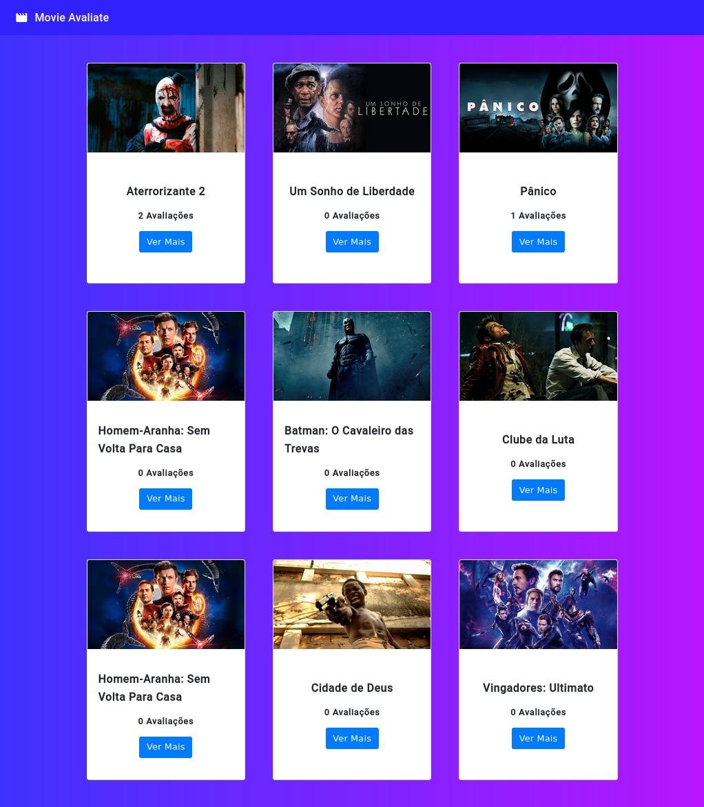
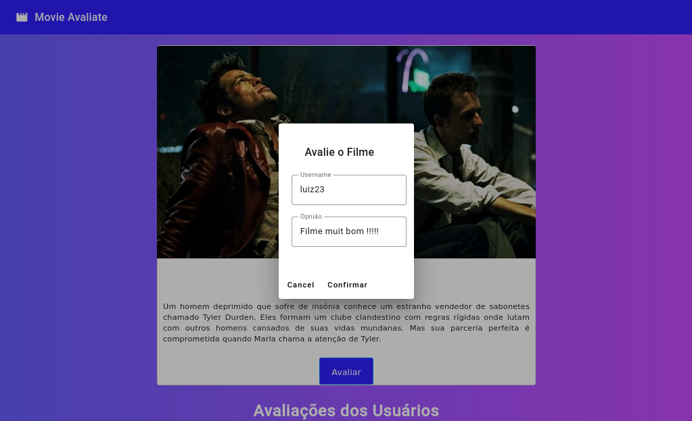
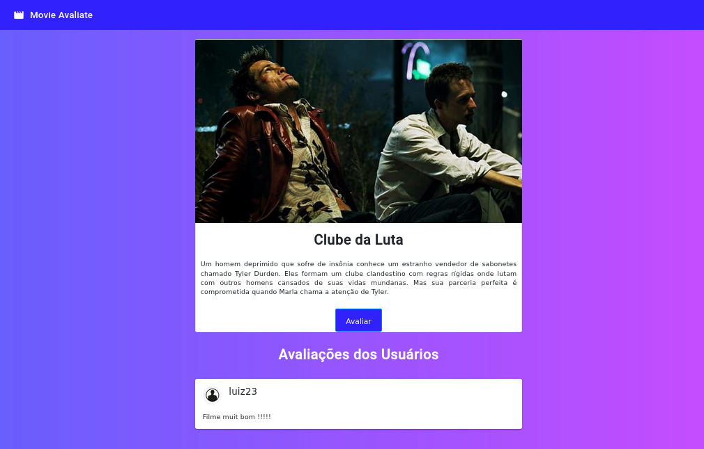

# Movie Avaliate

## Home


## Modal para Avaliação


## avaliação do filme



# Execução
## Backend
### instalando
```bash
$ npm install 
```

### Container mysql do docker
```bash
$ docker compose up
```
### rodando backend em nestjs
```bash
$ npm run start:dev
```

> Para popular o banco de dados da aplicação, basta executar o caminho em um client Rest, via POST com os dados do `movie.json`, que se encontra em `movie-avaliate/backend/movie.json`.
~~~
http://localhost:3000/movie  via POST
~~~

# Frontend 

### Instalando
```bash
$ npm install 
```

### rodando frontend
```bash
$ ng serve
```


